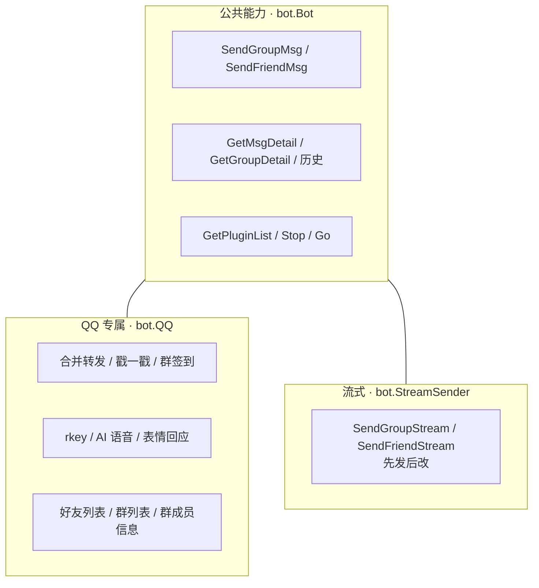
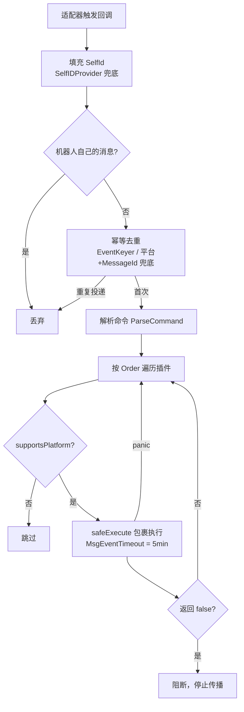
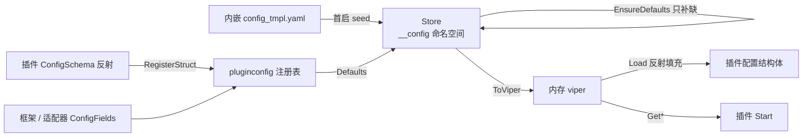

# 框架核心原理

本章深入介绍 AniaBot **框架部分**的技术原理：如何把五个差异巨大的平台归一化成同一种消息模型、事件如何沿插件链分发、插件生命周期与依赖注入如何工作、配置中心与存储层如何设计。

## 多平台归一化模型

AniaBot 所有平台共享同一套内部消息模型，适配器在边界做双向翻译。

### 1. 统一消息段：OB11Segment

框架以 **OneBot v11 消息段格式**作为规范形态（`common/model/message`）：

```go
type OB11Segment struct {
    Type string         // "text" / "at" / "image" / "face" / "reply" / "video" ...
    Data map[string]any
}
```

- **入站**：适配器把平台事件翻译成 `message.Message`（内含 `[]OB11Segment` 与统一字段 `MessageId / UserId / GroupId / Sender / SelfId / Platform`）
- **出站**：插件用 `msgchain.Builder()` 构造段数组，core 路由后由适配器翻译成平台 API 调用

```mermaid
flowchart LR
    subgraph In[入站翻译]
        E1[飞书事件] --> T1[飞书适配器 translate]
        E2[Telegram Update] --> T2[Telegram 适配器 translate]
        E3[OneBot JSON] --> T3[NapCat 适配器 解析]
    end
    subgraph Mid[统一消息模型]
        M[message.Message<br/>[]OB11Segment + Platform]
        C[Core 分发 / 路由]
        PL[插件链]
        B[bot.Bot / msgchain]
    end
    subgraph Out[出站渲染]
        A1[飞书适配器 render]
        A2[Telegram 适配器 render]
        A3[NapCat 适配器 render]
        O1[飞书 API]
        O2[Telegram API]
        O3[OneBot 调用]
    end
    T1 --> M
    T2 --> M
    T3 --> M
    M --> C
    C --> PL
    PL --> B
    B --> C
    C --> A1
    C --> A2
    C --> A3
    A1 --> O1
    A2 --> O2
    A3 --> O3
```

各平台都实现一套 `translate.go`（入站）与 `send.go`（出站），例如飞书把 `post` 富文本块翻译成 text/at/image 段，Telegram 把 `message_entity` 翻译成 at/face 段，Discord 把 `MessageCreate` 翻译成文本段。

### 2. 统一 ID：QID + 前缀体系

```go
type QID string // 提供 String() / Uint64()
```

- **QQ 历史裸数字 ID 无前缀**：存量数据零迁移，未命中任何前缀的 ID 自动路由到无前缀的默认适配器
- 其他平台统一带前缀：QQ 官方 `qo:`、飞书 `fs:`、Telegram `tg:`（消息 ID 为 `tg:<chat_id>:<message_id>`）、Discord `dc:<channel_id>:<message_id>`
- 前缀在适配器的 `Definition.IDPrefix` 中声明，注册时**重复前缀直接 panic**（启动期编程错误）

### 3. 能力分层：公共接口 + 可选接口

平台差异不可能全部塞进一个接口，AniaBot 采用「洋葱」式能力模型：



- 适配器侧对应 `adapter.QQExt` / `adapter.StreamSenderExt` 等可选接口
- `adapter.WrapBot(base, src)` 按事件来源适配器把公共 `bot.Bot` 包装成带专属能力的扩展外观
- 插件侧 `if qb, ok := b.(bot.QQ); ok` 类型断言探测，断言失败即平台不支持，优雅退化

```go
// 框架在 addAdapter 时完成包装，事件分发时把包装后的外观传给插件
func (ania *AniaBot) addAdapter(def adapter.Definition, a adapter.Adapter) {
    e := &adapterEntry{def: def, adapter: a}
    e.evBot = adapter.WrapBot(ania, a) // 应用全部已注册 BotWrapper
    a.SetTrigger(ania.makeTrigger(e))
    ania.adapters = append(ania.adapters, e)
}
```

### 4. 消息段能力声明

适配器还可实现 `adapter.SegmentSupport` 声明出站能渲染的段类型集合；core 发送时对不支持的段类型**告警但不阻断**（替代适配器出站静默丢弃）。

## 适配器注册表

新增平台零核心改动，靠的是 `common/adapter` 的注册表：

```go
type Definition struct {
    Name         string                  // 适配器名，启用键 bot.platform.<name>.enable
    Platform     string                  // 平台标识（"qq" / "feishu" / ...），写入事件 Platform
    IDPrefix     string                  // ID 前缀（"fs:" / "tg:" / "dc:"），空 = 无前缀默认平台
    ConfigFields []pluginconfig.Field    // 面板动态渲染的配置字段
    New          func(*viper.Viper) (Adapter, error)
}
```

- 平台包在 `init()` 中调用 `adapter.Register(d)`，重复注册 / 重复前缀 panic
- `Definitions()` 按 Name 排序返回，保证遍历稳定
- core 在 `Run()` 中遍历注册表，按 `bot.platform.<name>.enable` 创建实例
- 平台专属能力通过 `RegisterBotWrapper(w)` 注册包装器，`WrapBot` 依次应用

```go
// cmd/main.go 新增平台只需一行空白导入
_ "github.com/jeanhua/AniaBot/bot/adapter/discord"
```

## 事件分发管线

适配器通过 `SetTrigger(TriggerWrapper)` 拿到一组回调，事件从平台进入 core 后经历完整的分发管线：



### 幂等去重

事件订阅多为 **at-least-once 投递**（飞书断线重连 / ACK 丢失会重推）。core 统一按去重键去重（`dedup.go`）：

- 适配器实现 `adapter.EventKeyer` 提供稳定键（优先）
- 消息兜底键 = `平台 + MessageId`；通知不做组合兜底（避免同一秒两次真实事件被误判）
- 存储用缓存层（内存 map / Redis `SET NX EX`），TTL 10 分钟，有界
- **fail-open 语义**：去重存储故障时放行——at-least-once 下宁可重复处理一次，不能静默丢消息

### 平台过滤

每个插件按 `Meta.Platforms` 过滤：`Platforms` 为空表示支持全部平台（向后兼容），否则仅当事件来源平台的标识命中时才收到事件。QQ 专属通知（戳一戳、运气王……）在非 QQ 平台永远不会触发。

### 中间件链

消息事件按 `Order` 从小到大执行，返回 `(bool, error)`：

- `true` → 继续传播；`false` → 阻断（后续插件收不到）
- 三档参考值：`LevelLog(-1000)` → `LevelNormal(0)` → `LevelPostHandle(1000)`（AI 对话插件在最后，作为兜底响应）
- 插件 panic **不阻断**：`safeExecuteWithReturn` 捕获后视为 `true` 继续传播（与通知事件一致）
- 每个插件调用都有独立超时（消息 5 分钟、生命周期事件 1 分钟），防止插件挂死拖垮整个分发

### 通知广播

14 种公共通知与 `OnPlatformEvent` 平台事件是**广播制**：全部插件都会收到、无阻断、某个插件 panic 不影响其他插件。

## 插件生命周期与依赖注入

### 生命周期

```
AddPlugin() → 按 Order 排序
  → Start(ctx, cfg)       配置结构体已填充、DI 已注入
  → StartCron(ctx, bot, c) 注册框架共享 cron
  → Awake(ctx, bot)        启动完成 1 秒后（首次向导未完成时跳过）
  → OnGroupMsg / OnFriendMsg / OnXxxNotice / OnPlatformEvent  运行期事件
  → OnPanic(ctx, bot, name, err)  任何插件或 bot.Go 协程 panic 时
```

### 依赖注入

`Start` 前框架注入（`common/plugin.Meta` 字段）：

| 依赖 | 类型 | 说明 |
| --- | --- | --- |
| `Storage` | `storage.Storage` | 缓存层，已按插件名 base64 命名空间隔离 |
| `PersistentStorage` | `storage.PersistentStorage` | 持久化 KV，同样按插件名隔离 |
| `RestyClient` | `*resty.Client` | HTTP 客户端 |
| `Logger` | `*slog.Logger` | 结构化日志（已带插件名 group） |
| `SystemConfig` | `plugin.SystemConfig` | 管理员 ID 等系统级配置 |
| `ConfigEditor` | `plugin.ConfigEditor` | 配置中心读写（可能为 nil，需判空） |

注入实现是 `Meta.SetStorage(...)` 等 setter；`ConfigSchema()` / `ConfigFields()` 在 DI **之前**被调用（纯元信息声明，实现不得依赖注入字段，且必须每次返回同一指针）。

### 并发模型

- 插件每次调用被 `safeExecute` 包裹，panic 只影响自身
- 插件内需要协程时用 `bot.Go(name, f)`：panic 自动恢复并回调所有插件 `OnPanic`（每个 OnPanic 调用自身也有 recover，防止连环 panic 杀死进程），同时维护 goroutine 计数供面板展示
- WebSocket 适配器采用**工作池 + 消息队列**：连接层只收发，解析与分发在 worker 协程完成；`worker_count` 默认 `CPU×2`，队列满丢弃（日志可查），ACK 帧直接投递不排队（避免 worker 全部阻塞等 ACK 时互相饿死）

## 配置中心

所有配置存数据库（`ania_kv` 表，保留命名空间 `__config`），键为点分路径，值 JSON 编码以保留类型。

### 数据流



- `Init()`：首启写入默认配置并标记 `meta.setup_pending`（进入设置向导）
- `EnsureDefaults()`：只补缺失键，**永不覆盖**——插件升级新增配置键下次启动自动补齐
- `ToViper()`：构建内存 viper，插件 `Start(ctx, *viper.Viper)` 语义与历史完全一致
- `ANIA_` 环境变量可覆盖任意配置键（优先级最高、不写回数据库），容器部署友好

### pluginconfig：动态表单注册表

面板表单不是写死的，而是从注册表动态渲染：

- `ConfigRegistrar.ConfigFields()`：框架字段与适配器字段的低层声明方式
- `ConfigSchemaProvider.ConfigSchema()`：插件声明配置结构体，框架**反射** `cfg` 标签生成字段（key/label/type/group/help/sensitive/default），类型从 Go 字段类型推断，指针标量 = 可选参数（未设置时保持 nil），切片默认值逗号分隔
- 同一注册表、同键后者覆盖前者；面板表单自动出现新字段，无需改面板代码

### 环境变量引导

持久化存储本身不经过配置中心（避免鸡生蛋）：`ANIABOT_STORE_DRIVER`（sqlite|mysql）/ `ANIABOT_SQLITE_PATH` / `ANIABOT_MYSQL_DSN`。

## 双层存储

| 层 | 接口 | 后端 | 语义 |
| --- | --- | --- | --- |
| 缓存 | `storage.Storage` | 内存（默认）/ Redis | TTL、列表、`WithCheckExist` 原子占用 |
| 持久化 | `storage.PersistentStorage` | SQLite（默认）/ MySQL | KV/文档、重启不丢、无 TTL |

### 命名空间隔离

`Clone(prefix)` 返回带前缀的子存储，前缀可多级嵌套；框架注入时用 `base64(pluginName)` 隔离，插件之间永远不冲突。内存后端共享同一把锁与底层 map，Redis 后端共享连接。

### SQL 可选能力

SQL 后端额外实现 `storage.SQLPersistentStorage`（`SQLDB()` / `SQLDialect()`），与 `bot.QQ` 同款探测惯例：

```go
db, dialect, ok := storage.SQLBackend(p.PersistentStorage)
if !ok { /* 回退纯 KV，功能不缺失 */ }
storage.EnsureTables(ctx, db, dialect, storage.TableDDL{...})
```

- `EnsureTables` 幂等建表，双方言 DDL 各一组
- 插件自建表统一 `ania_` 前缀；约定 MySQL 字符串键 `VARCHAR(255) COLLATE utf8mb4_bin`、大载荷 `MEDIUMTEXT`、时间戳整数秒或定宽 UTC 文本
- **SQL/KV 双路径语义一致**：SQL 冗余过滤列只收窄 WHERE，Go 侧匹配仍是最终判定
- 探测/建表失败只记日志并回退 KV，绝不阻断插件启动

典型的「KV 抽象 + SQL 加速」案例：AI 对话历史（`ania_chat_session` / `ania_chat_message` 行级，追加只 INSERT）、长期记忆（`ania_memory`）、操作日志（`ania_op_log`）、Query 日志（`ania_query_log`）、任务日志（`ania_task_log`）——非 SQL 后端全部回退为命名空间 KV。

## Web 控制面板与审计

- 面板后端 `bot/adminpanel` 提供配置/状态 API，前端（Vue 3 + Tailwind）构建产物经 `go:embed` 嵌入二进制
- 面板通过 `adminpanel.XxxSource` 可选接口发现插件能力（定时任务、记忆、Skill、知识库、团队、配额、Query 日志等），插件实现即出现在面板，无需面板代码改动
- 操作日志（`bot/component/oplog`）以包级单例记录面板与 AI 工具的管理操作（登录、配置修改、定时任务/记忆/Skill/团队管理、AI 改配置、重启更新等），SQL 后端走 `ania_op_log` 行级存储 + 范围删除淘汰，KV 后端走 `e:<序号>` 逐条记录，ID 均为 base36 自增序号，两种后端一致

## 关键设计取舍

| 取舍 | 理由 |
| --- | --- |
| 配置存数据库而非 yaml | 面板可视化、多实例共享（MySQL）、插件配置动态注册 |
| 返回值 `(value, bool)` 而非 error | 适配器/存储层调用频繁且多为“尽力而为”，错误内部记日志，接口更轻 |
| 可选接口 + 类型断言而非大接口 | 平台能力差异巨大，大接口会让新平台适配成本暴涨 |
| 广播制通知 + 中间件链消息 | 消息需要“抢答/阻断”语义，通知需要“所有人都看到”语义 |
| 纯 Go 驱动（无 CGO） | 交叉编译开箱即用（sqlite 用 modernc.org、mysql 用 go-sql-driver） |

## 下一步

- [AI 引擎（一）LLM 客户端与对话循环](/internals/agent-llm) —— Agent 部分从哪里开始
- [技术原理总览](/internals/) —— 回到总览

